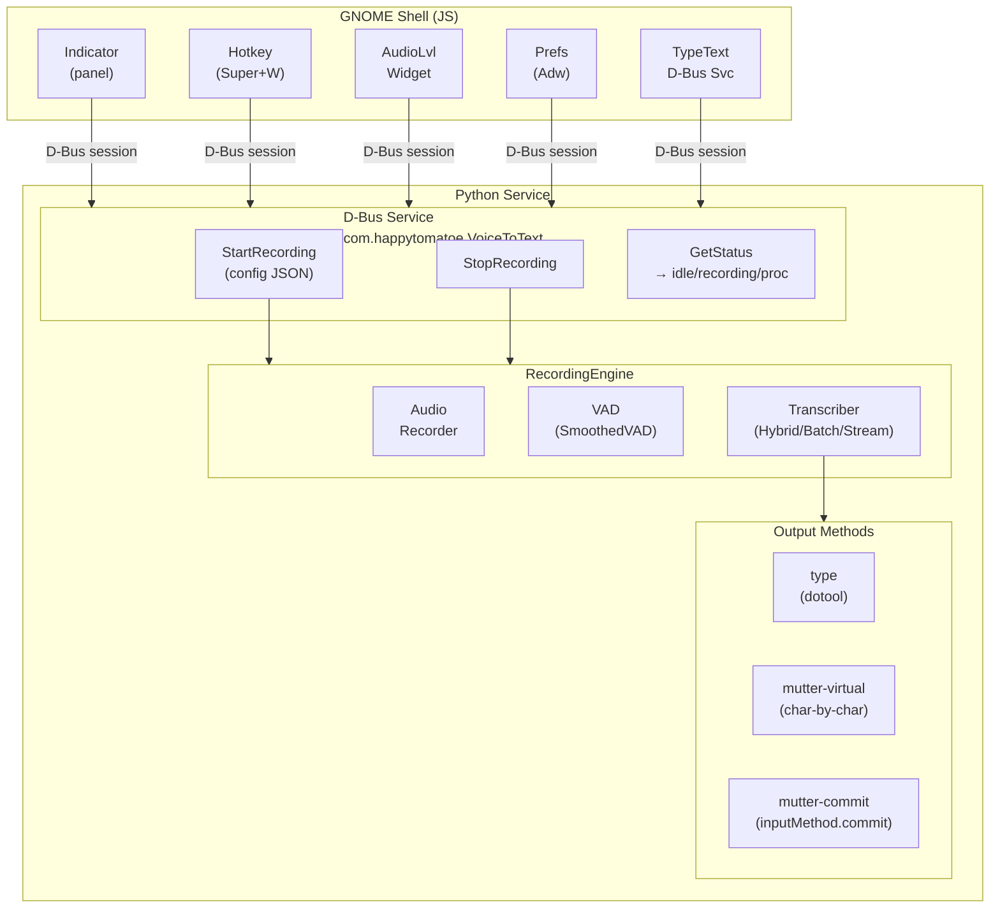
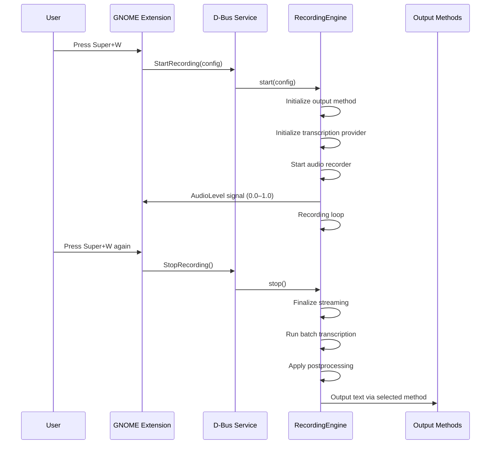
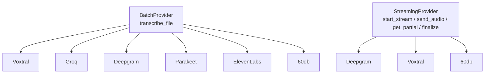

# Architecture & Troubleshooting

How voice-to-text works end-to-end, the components involved, and where to look
when something breaks.

> **Agent instructions:** see `AGENTS.md` for coding conventions, tooling, and
> project-specific guidelines that apply when modifying this codebase.

## System Overview



## Recording Flow

Trace from hotkey press to text output:



## How it works (end to end)

1. The user presses the hotkey (**Super+W**) in GNOME Shell.
2. The GNOME Shell extension (`gnome-ext/extension.js`) builds a JSON config and
   calls `StartRecordingAsync` on the D-Bus service
   `com.happytomatoe.VoiceToText` (object `/com/happytomatoe/VoiceToText`).
3. The Python service (`src/voice_to_text/`) owns that D-Bus name. Its
   `VoiceToTextInterface` forwards the call to the `RecordingEngine`.
4. The engine captures microphone audio with `sounddevice.InputStream`
   (16 kHz, mono, int16) into a `tempfile` WAV and an `asyncio.Queue`.
   - If a Bluetooth headset is configured, it is switched to HSP/HFP and made the
     default source before recording (`bluetooth.activate_headset_mic`).
   - Speaker volume is lowered during recording (`audio.SpeakerVolumeManager`).
5. Audio is transcribed by a provider (see Modes below).
6. The result is output: typed via `dotoolc` (`typer.DotoolTyper`),
   copied to the clipboard, or discarded (`output_method` in config).
7. Pressing the hotkey again calls `StopRecording`; the engine transitions to
   `processing`, finishes transcription, emits output, then returns to `idle`.

During recording the engine emits D-Bus signals the extension uses to drive the
UI: `AudioLevel` (0.0–1.0), `StateChanged` (`idle`/`recording`/`processing`),
and `Error`.

## Components

| Component | Path | Role |
|-----------|------|------|
| GNOME extension | `gnome-ext/extension.js`, `indicator.js`, `hotkey.js`, `prefs.js`, `typer.js` | Client UI; hotkey, tray icon, preferences; calls D-Bus. |
| D-Bus entry point | `src/voice_to_text/__main__.py` | Connects to session bus, owns the name, runs until SIGTERM/SIGINT. |
| D-Bus interface | `src/voice_to_text/dbus_service.py` | `StartRecording` / `StopRecording` / `GetStatus` methods + signals. |
| Recording engine | `src/voice_to_text/engine.py` | State machine (`idle`/`recording`/`processing`); orchestrates the pipeline. |
| Audio capture | `src/voice_to_text/audio.py` | `AsyncAudioRecorder` (sounddevice + queue) and speaker volume control. |
| Bluetooth | `src/voice_to_text/bluetooth.py` | Switches headset to hands-free mic before recording. |
| Providers | `src/voice_to_text/providers/*.py` | Cloud (Voxtral, Groq, Deepgram, 60db, ElevenLabs) and local (Parakeet) transcription. |
| Hybrid | `src/voice_to_text/hybrid.py` | Mixes a streaming provider (live partials) with a batch provider (final pass). |
| Output | `src/voice_to_text/typer.py` | Incremental typing via `dotoolc`; clipboard fallback. |
| Config | `src/voice_to_text/config.py`, `config.yaml` | Loads/resolves provider config and secrets. |

## Transcription modes

Selected by `transcription.mode` in `config.yaml` (also overridable per call):

- **batch** — record fully, then send the WAV to one provider (`provider`).
- **hybrid** — stream partials from `streaming_provider` while recording, then a
  final `batch_provider` pass for the corrected result.
- **streaming** — stream-only; `streaming_provider` is used for both live and final.

## Output Methods

| Method | Class | How it works | Speed | Internal API |
|--------|-------|--------------|-------|--------------|
| `type` | `DotoolTyper` | Types via dotool (requires `dotoolc`) | Slow (keystroke-by-keystroke) | No (external tool) |
| `mutter-virtual` | `MutterVirtualTyper` | Char-by-char typing via D-Bus virtual keyboard | Slow (keystroke-by-keystroke) | Yes (`Clutter.InputDevice`) |
| `mutter-commit` | `MutterVirtualPaster` | Commits text via `Main.inputMethod.commit()` | Fast (single call) | Yes (`Clutter.InputMethod`) |


## D-Bus Interfaces

### com.happytomatoe.VoiceToText

| Method | Signature | Description |
|--------|-----------|-------------|
| `StartRecording` | `(json_string)` | Start recording with config |
| `StopRecording` | `()` | Stop current recording |
| `GetStatus` | `() → string` | Return `idle`/`recording`/`processing` |
| `ListInputDevices` | `() → a(ss)` | List available mic devices |

| Signal | Signature | When |
|--------|-----------|------|
| `AudioLevel` | `(double)` | During recording (0.0–1.0) |
| `StateChanged` | `(string)` | State transitions |
| `Error` | `(string)` | On error |

### com.happytomatoe.TypeText

| Method | Signature | Description |
|--------|-----------|-------------|
| `TypeText` | `(text)` | Type text via virtual keyboard |
| `CommitText` | `(text)` | Commit text via `Main.inputMethod.commit()` |

## Provider Architecture



All streaming providers extend `WebSocketStreamingProvider` which handles the Deepgram-compatible WebSocket protocol.

## Configuration & secrets

- `config.yaml` (repo copy) documents all options; the live config lives at
  `~/.config/voice-to-text/config.yaml`.
- API keys come from env vars, `config.yaml`, or command substitution
  (`!command` or `!!command`), as described below.
- **Command substitution (`!command`)**: If an `api_key` value starts with `!`,
  the rest of the string is executed as a shell command. The command's stdout
  is used as the API key. This enables integration with secret managers like
  1Password, pass, or custom scripts.
  ```yaml
  # Example: run a script that returns the API key
  voxtral:
    api_key: "!bash /path/to/get-key.sh"
  ```

  ```yaml
  # Example: use secret-tool directly
  voxtral:
    api_key: "!secret-tool lookup service mistral type api_key"
  ```

  ```yaml
  # Example: 1Password CLI
  voxtral:
    api_key: "!op read 'op://Vault/Mistral/key'"
  ```
  - The command runs fresh each time (no caching)
  - Supports shell pipes and quotes (`shell=True`)
  - 10-second timeout
  - Raises `ValueError` on failure, timeout, or empty output
- **Async command substitution (`!!command`)**: If an `api_key` value starts
  with `!!`, the command runs in the background while recording starts
  immediately. The API key is resolved when the provider needs it (before
  transcription). This reduces recording start latency.
  ```yaml
  # Async: recording starts immediately, key resolves in background
  voxtral:
    api_key: "!!bash /path/to/get-key.sh"
  ```
  - Use when key resolution is slow (e.g., network calls to secret managers)
  - Recording starts in parallel with key resolution
  - Key is awaited only when transcription begins
  - Falls back to synchronous behavior if key is already cached
- Changing keys: stop the service (`just service-stop`) so it restarts with
  fresh secrets on next use.

## Troubleshooting

### Where to look

- **Service log:** `/tmp/voice-to-text.log` (set by `logging.file` in
  `config.yaml`; level via `logging.level`).
- **Live service logs:** `just service-logs` (tails `journalctl --user` filtered
  to "voice").
- **GNOME extension logs:** run a nested shell (`just gnome-ext-dev`) and watch
  `/tmp/gnome-shell-nested.log`; extension D-Bus errors also print with
  `console.error('VoiceToText: ...')`.

### Is the service even running?

- `just service-status` — shows the `voice-to-text-dbus` process, or "not running".
- The D-Bus name `com.happytomatoe.VoiceToText` is owned via D-Bus *activation*:
  the service starts on first request from the extension. If it crashes, it will
  be restarted on the next request (unless it exits with a fatal name-claim
  error, e.g. another instance owns the name).

### Run in the foreground for debugging

- `just service-run` runs `uv run voice-to-text-dbus` in the foreground so you
  see log output directly.
- `just gnome-ext-dev` installs the extension and launches a nested GNOME Shell
  with both the service and shell logs captured to `/tmp/*.log`.

### Common failure points

- **`Failed to start recording` / D-Bus `StartRecording` errors** — the engine
  rejects a start while not `idle`, or the JSON config is invalid/missing. The
  error text comes back through the `Error` signal and the extension notification.
- **No microphone / no audio level** — check the capture device (`device` in
  config, or default). The BT headset step (`bluetooth_mic: true`) can fail
  silently (logged at DEBUG). Verify the intended source is default in
  PipeWire/WirePlumber.
- **Typing does nothing** — `dotoolc` (`dotool`) must be installed and the user
  in the `input` group for `/dev/uinput` access. Without it, the engine logs
  `DotoolcNotFoundError`; with `output_method: type-fallback-clipboard` it falls
  back to the clipboard.
- **Clipboard empty** — needs `wl-copy` (Wayland) or `xclip`/`xsel` (X11).
- **Provider/API errors** — bad or missing keys (check `api_key` in config),
  wrong model name, or network/quota issues. These surface via the
  provider's `ValueError` exception, logged as `Error: API key` by the caller.
- **Stuck in `processing`** — transcription can take up to `engine.stop_timeout`
  (default 120 s) before the engine force-cancels.

### Performance profiling

Set `profiling: true` in `config.yaml`. The engine logs per-step timings
(`[PROFIL]`) for startup through output, useful when recording start or
transcription feels slow.
